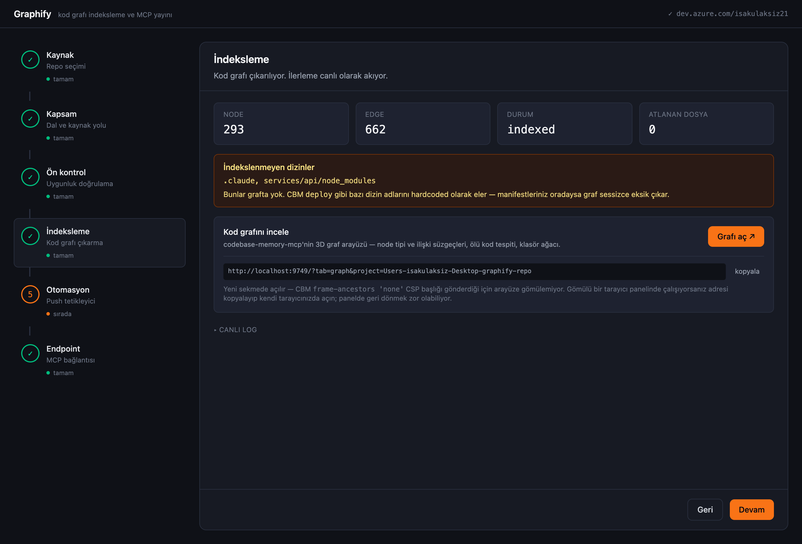
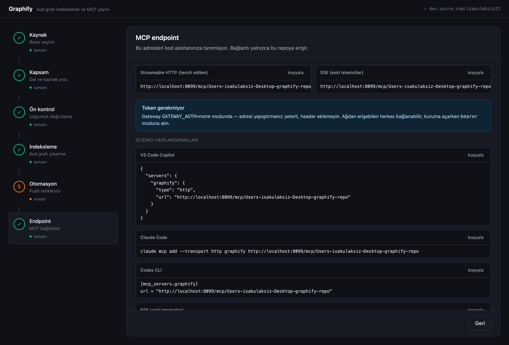

# graphify-platform

[Türkçe](README.md) · **English**

Internal platform that extracts a repository's code graph with `codebase-memory-mcp`
and serves it to Copilot / Codex / Claude Code as an MCP endpoint.

## Screenshots

**Indexing** — live progress, node/edge counters, excluded-directory warning, and a
link to CBM's 3D graph UI.



**Endpoint** — the generated MCP addresses and ready-to-paste config for four clients.



## Components

| Directory | What it does | Port |
|---|---|---|
| [`gateway/`](gateway) | Publishes the CBM stdio server over SSE + Streamable HTTP, enforces per-project authorization | 8099 |
| [`control-api/`](control-api) | Control plane the UI talks to: repo listing, indexing jobs, endpoint info | 8090 |
| [`web/`](web) | n8n-style stepper UI | 5180 |

The repositories to be indexed do not live in this repo — the platform pulls them
from Azure DevOps or uses local clones on disk.

## Running with Docker

```bash
cp .env.example .env      # fill in the values
docker compose up -d --build
```

UI: **http://localhost:5180**

| Service | Port | Note |
|---|---|---|
| `web` | 5180 | nginx; proxies `/api` to control-api |
| `gateway` | 8099 | MCP endpoints |
| CBM graph UI | 9749 | served by the daemon in the gateway container |
| `control-api` | — | not exposed; reachable only through nginx |

Stop: `docker compose down` · also drop data: `docker compose down -v`

### Why gateway and control-api share one image

Both need the CBM binary (297 MB). Separate images would store it twice, so one
image is built and run with different commands in compose.

They **share** the CBM database via the `cbm-data` volume. This was verified by
experiment: separate containers can work concurrently on the same volume — one can
hold an open MCP session while the other runs a CLI command.

> ⚠️ **control-api must stay at one replica.** Two copies indexing at once would
> race through CBM's per-project locks. To scale, split repositories across
> separate compose groups / namespaces.

### Three problems solved in Docker

These surfaced during setup; all are handled in `Dockerfile` /
`docker-compose.yml`, but it helps to know why they are written that way.

**1. The CBM cache directory must be 0700.** The usual `chmod 777` container
reflex stops CBM entirely:
`secure CLI coordination could not be created (cache-private)`.

**2. The graph UI binds to 127.0.0.1 only.** There is no bind-address option, so
Docker port publishing alone does not reach it — a `socat` bridge was added
(9750 in the container → 127.0.0.1:9749).

**3. The daemon serving the UI stops when the last client disconnects.**
`daemon.runtime_stopping reason=last_committed_client_disconnected`. A one-shot
`--ui=true` command exits and takes the UI with it. Fix: a long-lived MCP session
with stdin held open (`sleep infinity | codebase-memory-mcp`).

**Also:** internal and public addresses are now separate. For `control-api`,
`localhost` is its own container, so it probes the gateway at
`http://gateway:8099`. Without that split the snippets were generated wrong —
an `Authorization` header was added even though no token was required.

### On-premises Azure DevOps

The address structure has the same shape as the cloud; only the base URL and the
collection change:

```
https://devops.company.com / DefaultCollection / project / _git / repo
└────── AZDO_BASE_URL ────┘ └─── AZDO_ORG ───┘
```

```bash
AZDO_BASE_URL=https://devops.company.com
AZDO_ORG=DefaultCollection
```

Because the query runs at collection level, repositories from **all projects** in
that collection appear in the list. The address can also be entered in the UI
(Source step).

Older servers may not support API 7.1 — lower it with `AZDO_API_VERSION`
(2019 → `5.1`, 2020 → `6.0`).

### Three things you will hit

**1. Internal CA certificate.** If your server is signed by a corporate CA, Node
reports `unable to verify the first certificate`. Put the certificate under
`certs/` and set:

```bash
NODE_EXTRA_CA_CERTS=/certs/company-ca.crt
```

`certs/` is mounted read-only into the container and is in `.gitignore`.

**2. Air-gapped image builds.** The `Dockerfile` pulls CBM from npm. Without
internet access, point the `npm install -g` line at your internal registry or
`COPY` the binary into the image. Do not leave it to a runtime download.

**3. Public addresses.** `GATEWAY_PUBLIC_URL` and `CBM_UI_PUBLIC_URL` must be
reachable from the user's browser — the UI prints them in client configurations.
Do not leave them as `localhost` when deploying to a server.

### A Docker-specific problem, solved

The CBM cache directory must be **owner-private (0700)**. If it is world-writable,
CBM refuses to run any command:

```
secure CLI coordination could not be created (cache-private)
```

The `Dockerfile` therefore assigns `0700` owned by the `node` user rather than
`chmod 777`. This part will need revisiting for OpenShift, which runs with a
random UID.

## Running locally (without Docker)

Three separate terminals:

```bash
cd gateway && CBM_BINARY=$(which codebase-memory-mcp) GATEWAY_AUTH=none PORT=8099 npm run dev
```

```bash
cd control-api && CBM_BINARY=$(which codebase-memory-mcp) PORT=8090 \
  GATEWAY_BASE_URL=http://localhost:8099 WEBHOOK_SECRET=change-me \
  LOCAL_REPO_ROOTS="$HOME/Desktop/graphify-repo" npm run dev
```

```bash
cd web && npm run dev
```

UI: http://localhost:5180

To list Azure DevOps repositories, enter the organization and PAT **in the UI**
(Source step). The token is held only in the control-api's memory; it is never
written to disk, never logged, and never returned in any response. It can also be
supplied via the `AZDO_ORG` / `AZDO_PAT` environment variables.

## Authentication modes

The gateway runs in one of two modes, selected by `GATEWAY_AUTH`:

| Mode | Behavior |
|---|---|
| `none` (default) | No token required — connect directly |
| `bearer` | `Authorization: Bearer <token>` required; token→project mapping from `GATEWAY_TOKENS` |

> ⚠️ In `none` mode, anyone who can reach the gateway over the network can read
> **every repository**. Fine for local development; switch to `bearer` before
> deploying to OpenShift — one environment variable, no code change.

Regardless of mode, **project scoping and the tool allowlist still apply**: a
connection is locked to the repository in the URL, and `index_repository` /
`delete_project` / `ingest_traces` are blocked.

## UI steps

1. **Source** — Azure DevOps connection (org + PAT) and repo selection; already-indexed repos are marked
2. **Scope** — branch selection (searchable dropdown, fetched live from the repo)
3. **Pre-check** — fetches the source code (clones/updates) and validates it
4. **Indexing** — live log over SSE, node/edge counters, excluded-directory warning, and a link to the code graph
5. **Automation** — auto-update toggle + webhook subscription
6. **Endpoint** — MCP URLs + ready-to-paste config for 4 clients

## Where the source code comes from

The user is never asked for a path. The pre-check step prepares the repo for indexing:

| Repo type | Behavior |
|---|---|
| Azure DevOps | Clones if absent, `git fetch` if present; checks out the selected branch |
| Local | Uses the on-disk path directly, no cloning |

Clones live under `CLONE_ROOT` (default `~/.cache/graphify/repos`). The directory
name is deterministic — `<project>-<repo>-<id>` — so the same repo always reuses
the same directory.

The PAT is passed to git **as a header** (`http.extraHeader`), never embedded in
the URL — embedding would leak it into the remote config, the reflog, and `ps`
output. `GIT_TERMINAL_PROMPT=0` and `stdio: ignore` make git fail fast instead of
hanging if a credential prompt appears.

## Graph visualization

CBM's own 3D graph UI is used — with node-type and relationship filters, dead-code
detection, and a folder tree. The indexing step shows a button that deep-links to
the project:

```
http://localhost:9749/?tab=graph&project=<project-name>
```

**Why it can't be embedded:** CBM sends
`Content-Security-Policy: … frame-ancestors 'none'`. That blocks iframing
absolutely and cannot be worked around client-side, so it opens in a new tab.

**No separate process to manage.** `--ui=true` is a persisted setting (it does not
appear in `config list` output but is effective). Once it has been run one time,
the daemon that starts with the gateway's MCP session brings the UI up as well:

```bash
codebase-memory-mcp --ui=true --port=9749   # once; the setting persists
```

The `/api/cbm-ui?project=<name>` endpoint reports whether the UI is up; if it is
down, the button is disabled and the command above is shown.

## Automatic graph updates

When a branch changes, the graph is re-extracted automatically. Two trigger paths
share the same coalescing window:

| Path | How | When |
|---|---|---|
| **Polling** | `git fetch` + `rev-parse origin/<branch>`, every `WATCH_POLL_MS` | Always — needs no publicly reachable address |
| **Webhook** | `POST /webhooks/azdo` — Azure DevOps `git.push` payload | When the platform is reachable from Azure DevOps |

After a change is detected the system waits `WATCH_DEBOUNCE_MS`; back-to-back
pushes coalesce into a single indexing run. Concurrency is 1 per repository.

```bash
# start / stop / inspect a watch
POST   /api/watch    {repoPath, repoName, branch}
DELETE /api/watch?repoPath=…
GET    /api/watch/state?repoPath=…
```

Webhook verification: if `WEBHOOK_SECRET` is set, the basic-auth password is
checked. Azure DevOps does not send HMAC signatures, so production also needs an
**IP allowlist**.

| Variable | Default | Purpose |
|---|---|---|
| `WATCH_POLL_MS` | 15000 | Git check interval |
| `WATCH_DEBOUNCE_MS` | 5000 | Push coalescing window (60000 recommended in production) |
| `WEBHOOK_SECRET` | — | Webhook basic-auth password |

## What you need to know when calling CBM programmatically

Behaviors found by experiment, none of them documented. The same traps apply to
any indexer worker built later.

### ‼️ stdin must be closed — otherwise the process hangs forever

`cbm cli <tool>` also accepts arguments on stdin, and if stdin is an **open pipe**
it waits for EOF indefinitely. Node's `spawn`/`execFile` default gives the child an
open pipe, so any programmatic call that does not close stdin deadlocks:

```
cbm cli list_projects < /dev/null    → returns immediately
sleep 30 | cbm cli list_projects     → hangs
```

Fix: `spawn(..., { stdio: ["ignore", "pipe", "pipe"] })`. See
[`control-api/src/cbm.ts`](control-api/src/cbm.ts).

### Put a timeout on every CLI call

If CBM hangs, the HTTP request hangs with it forever. The control-api kills the
process with `SIGKILL` after 30 s.

### Deduplicate concurrent CLI calls

CBM serializes commands through an admission barrier; spawning a process per HTTP
request makes them wait on each other and pays a ~2 s startup cost each time. The
control-api uses a 5 s cache plus single-flight requests.

### The 3D graph UI (`--ui=true`) leaves a daemon behind

It requires a TTY, and after being closed the daemon can linger; other CBM commands
then wait 30 s and fail. Recovery: `pkill -f codebase-memory-mcp`, or the
**Recover daemon** button in the UI.

### The gateway does not conflict with the CLI

An open gateway MCP session does not block `cbm cli` commands — tested.

## Verified state

Driven end to end in a browser: repo selection → pre-check → real indexing
(293 nodes / 662 edges, 2.4 s) → MCP connection to the endpoint the UI produced →
the same graph coming back. No console errors.

| Test | Result |
|---|---|
| Commit → polling → re-index | 17/16 → 19/20 nodes/edges (the 2 added functions) |
| Webhook (correct secret) | `matched:1`, trigger source `webhook`, 19/20 → 20/22 |
| Webhook (wrong secret) | HTTP 401 |
| Streamable HTTP — no headers at all | Connected, `query_graph` worked |
| SSE — no headers at all | Connected, `get_graph_schema` response arrived on the stream |
| Generated snippets (`authMode=none`) | None of the 4 snippets contain `Authorization` |
| Cloning — first call | `cloned`, `main` @ fe80d0fb |
| Cloning — different branch, second call | `updated`, `feature/yeni-ozellik` @ 3eba1c69, same directory |
| Local repo branch list + prepare | `master`, cloning skipped, `ready: true` |
| Azure DevOps — live repo (GRAPHIFY) | Cloned, 2 branches listed, indexed (293/662) |
| Endpoint test — both transports | All 7 checks passed via `test-endpoint.sh` |
| Docker: end to end (web → nginx → control-api → CBM) | Real indexing inside containers, 18 nodes / 18 edges |

**Not done:** automatic service-hook subscription from the UI, persistent job/watch
records and PAT storage (both reset when the process restarts), Entra ID
integration, automated tests.

## Testing an endpoint

MCP endpoints **cannot be tested in a browser**: a browser issues `GET`, while MCP
starts with `POST` + JSON-RPC. Same address, different request — different result.

```bash
./test-endpoint.sh http://localhost:8099/mcp/<project-name>
```

It exercises both transports end to end: session setup, `tools/list`, a tool call,
the SSE keep-alive ping, and the message channel.
